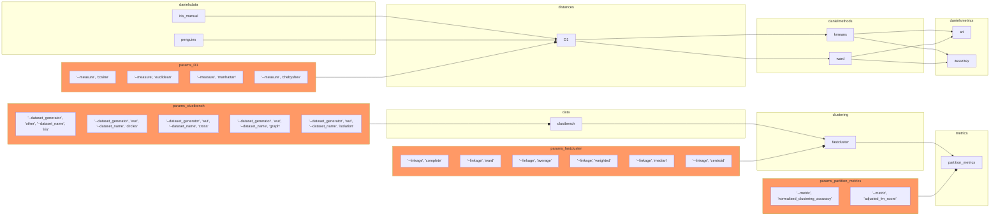

A clustering example for omnibenchmark

# clustbench logics

First, install Gagolewski's:

```{shell}
pip install clustering-benchmarks
```

and check it loads with

```{python}
import clustbench
```

Second, download the data

```{shell}
git clone https://github.com/gagolews/clustering-data-v1
```

Third, unpack these in an omnibenchmark-friendly way so datasets are this initial note params

```
for each dataset d:
  move the output to ./data/gagolewski/d/d.txt and ./data/gagolewski/d/d.labels 
```

Fourth, use `clustbench` to run methods, I guess with one git module each? or shall we do the method param trick?

And consider running them... with the method being a parameter?

https://github.com/gagolews/clustering-results-v1/blob/master/.devel/catalogue_generate.py

Methods list at https://github.com/gagolews/clustering-results-v1/tree/master/.devel

Finally, compute metrics via genie - rather, via clustbench.

# Layout


