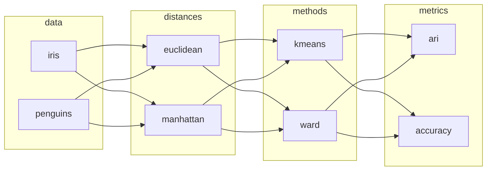

A penguins + iris clustering example. k-means with the true number of clusters as k.

```mermaid
flowchart LR
  subgraph data
    iris
    penguins
  end
  subgraph distances
     iris --> euclidean
     penguins --> euclidean
     iris --> manhattan
     penguins --> manhattan
  end
  subgraph methods
    euclidean --> kmeans
    manhattan --> kmeans
    euclidean --> ward
    manhattan --> ward
  end
  subgraph metrics
    kmeans --> ari
    ward --> ari
    kmeans --> accuracy
    ward --> accuracy
  end
```
